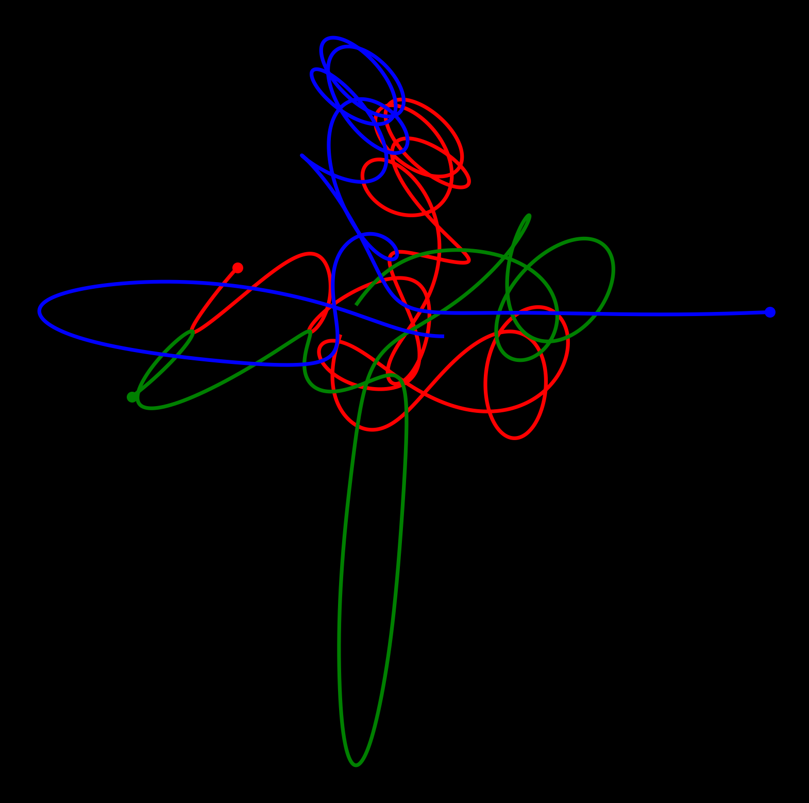

# Three-body noise generator



## The Three-Body Simulator(TBS)

The Three-Body simulator is now written.
See `threebody.py`.

See [this YT video](https://www.youtube.com/watch?v=MbhX1uRd6BI) for an example. Its initial condition follows.

    ```
    celbody1 = threebody.body(1,[-1, 0],    [0, -1])
    celbody2 = threebody.body(1,[-.5, 1],   [1, 1])
    celbody3 = threebody.body(1,[2, 0],     [0, 0])
    ```

## three IPython notebooks

### 1_simulator.ipynb

This notebook shows how to use `threebody.py`.
Also, it plots a trajectory (to check if the simulator works correctly).

The trajectory data with the initial condition of three celestial bodies are serialized.

### 2_noisemaker.ipynb

This notebook generates the noise of three voices from the pickled trajectory data.

`wav` file is generated.

### 3_videomaker.ipynb 

This notebook generates a video of the trajectory with the audio from the pickled trajectory data and `.wav` file.

`.mp4` file is generated.

## TODOS

* Code refactoring
* It would be a big project, but the same thing can be done with javascript etc. for the live demo on the web.